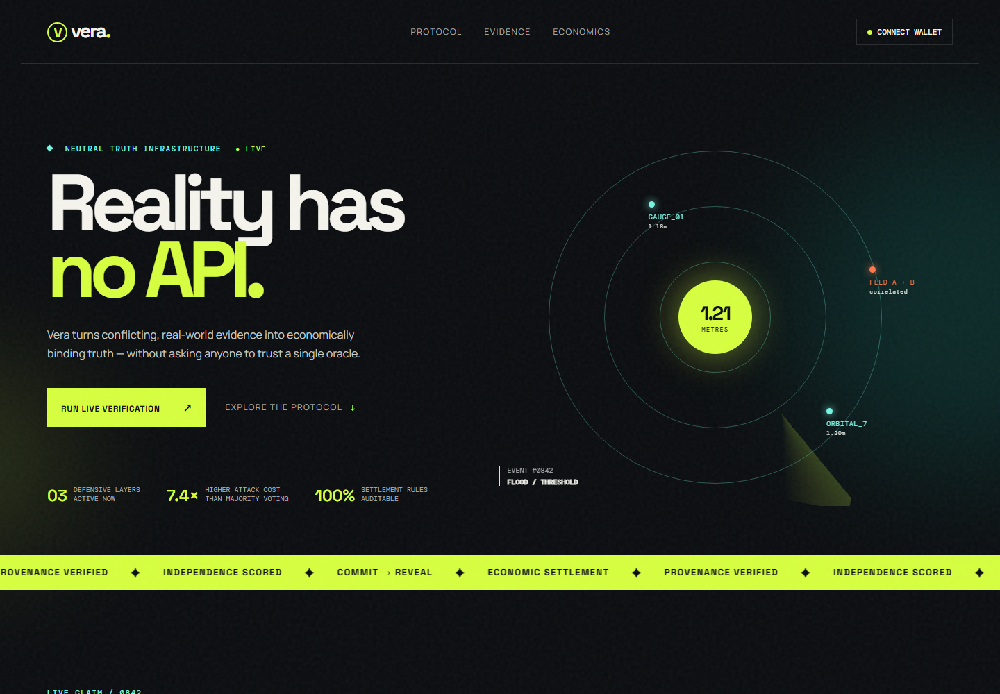
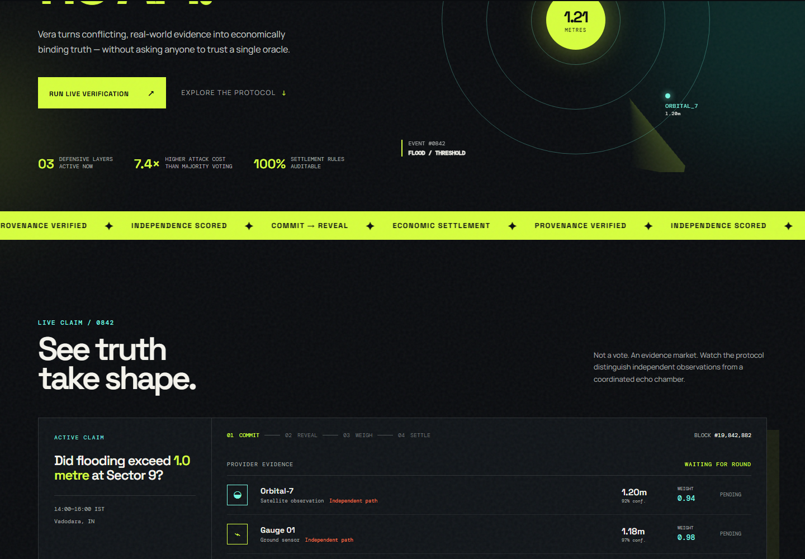

# Vera Protocol

> **Physical truth, credibly neutral.**

Vera is a first-stage product prototype for a decentralized physical-event verification protocol. It turns conflicting off-chain observations into an auditable, economically binding claim outcome - without letting a single oracle, insurer, claimant, or verifier company control the canonical truth.

The prototype is based on a flood-threshold settlement demo and carries the same mechanism into the longer-term Carbon MRV use case: independent evidence is more valuable than a crowd repeating the same source.



## The problem

Blockchains cannot observe rainfall, a flood gauge, a forest, cargo quality, or carbon removal on their own. For high-value real-world claims, evidence providers may also be economically motivated, correlated, or adversarial.

Vera is not "blockchain for sensor data." It is an evidence market that makes independent, useful observations economically preferable to copying, Sybil identities, and coordinated manipulation.

## What this prototype demonstrates

The live demo asks:

> Did flooding exceed **1.0 metre** at Sector 9, Vadodara, between 14:00 and 16:00 IST?

The dashboard shows four evidence providers:

| Provider | Evidence path | Observation | Protocol treatment |
| --- | --- | ---: | --- |
| Orbital-7 | Satellite observation | 1.20 m | High independent weight |
| Gauge 01 | Independent ground sensor | 1.18 m | High independent weight |
| RiverFeed A | Telemetry API | 1.23 m | Discounted - shared operator |
| RiverFeed B | Telemetry API | 1.23 m | Heavily discounted - correlated with A |

Click **Initiate evidence round** to play the full verification sequence:

1. Providers commit signed evidence before other observations are visible.
2. The protocol reveals and verifies each submission.
3. An independence engine discounts the two correlated RiverFeed reports.
4. The weighted result accepts the claim at **1.21 m / 96.4% confidence**.
5. The simulated ₹50 lakh escrow can be settled on the interface.



## Why the mechanism matters

Naive oracle systems treat a five-wallet majority as five independent witnesses. Vera makes a different distinction: five submissions sourced from the same operator are not five pieces of independent information.

The prototype visualizes three defensive layers:

- **Commit → reveal:** prevents providers from waiting for a majority and copying it.
- **Source graph and correlation scoring:** prevents duplicated feeds from being counted as separate evidence.
- **Stake-based settlement:** creates a path to reward useful evidence and penalize invalid or manipulative submissions.

## Carbon MRV mapping

The flood case is deliberately simple enough to understand in a demo. The same interface concept maps to Carbon MRV claims, where evidence can include project sensors, independent satellite data, field samples, laboratories, and supporting records.

| Flood demo | Carbon MRV equivalent |
| --- | --- |
| Flood level threshold | Verified tCO2e target |
| Gauge / satellite reading | Sensor, satellite, field, or lab evidence |
| Correlated RiverFeed sources | Auditors or datasets sharing an upstream dependency |
| Escrow release | Credit-issuance or payment authorization |

## Stack

This is intentionally a lightweight, zero-build front-end prototype:

- `index.html` - product structure and claim data
- `styles.css` - visual system, responsive layout, signal/radar visualization, and UI states
- `app.js` - interactive evidence round and mock settlement logic
- `assets/` - screenshots used in this README

The current proof of concept runs entirely in the browser. A production version would put claim commitments, stakes, reveal windows, and settlement state on an EVM-compatible contract, while retaining large evidence files and independence analysis off-chain.

## Run locally

No package installation is needed. Open `index.html` directly, or serve the folder locally:

```powershell
python -m http.server 4173
```

Then open [http://localhost:4173](http://localhost:4173).

## Scope and honest limitations

This is a concept-stage UX prototype, not a deployed oracle or financial settlement system. It simulates provenance, correlation analysis, confidence, and escrow settlement to make the mechanism legible. It does not yet include wallet integration, smart contracts, real signed evidence, hardware attestation, or a live satellite/sensor feed.

## Next product milestones

1. Connect a claim API and provider registry.
2. Implement EVM commit-reveal and stake contracts.
3. Ingest signed sensor/satellite evidence and persist evidence hashes.
4. Replace fixed weights with a source-dependency graph and reliability history.
5. Add adversarial simulation: Sybil, copying, cartel, bribe, and non-reveal scenarios.

---

Built as a hackathon prototype for decentralized, economically binding real-world verification.
